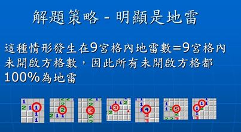

# MineSweeperAI
Test website: https://nick0603.github.io/MineSweeperAI/

## Test video

## Discuss Strategy
1. find absoluty mine or secure position
    - 
2. search the possible mine combination positions and filter them to find new mine or secure position
    - 
## license
- fork MineSweeper Game from maxwell repo: https://github.com/Maxwell-Alexius/Maxwell-CodePens/tree/master/2017_08_05_Mine_Sweeper
